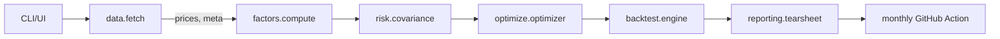

# Interview Brief

This repository demonstrates a pragmatic, production-minded approach to factor investing systems. It is intentionally complete: code, tests, docs, CI/CD, and two UIs (Streamlit + Excel), with a small marketing site.

## Design Principles

- Deterministic, offline-first defaults; graceful upgrade to live providers
- Simple, composable modules; clear interfaces; measured dependencies
- Opinionated constraints and realistic costs
- CI-ready: lint, typecheck, tests, security scan, coverage

## Architecture (Mermaid)

## Data Flow

- Fetch: Alpha Vantage → FMP → yfinance → synthetic sample (offline)
- Cache: local disk with TTL and hash by ticker+date
- Factors: standardized z-scores; composite and ranks; sector caps
- Risk: EWMA covariance with shrinkage
- Optimize: factor exposure constraints, caps, turnover penalty
- Backtest: monthly rebal, 5 bps costs, attribution; MC stress

## Trade-offs

- Fundamentals proxied offline to keep CI deterministic; easy to replace with real fundamentals when keys available
- PyPortfolioOpt used if present; otherwise a deterministic heuristic ensures constraints are met for demos/tests

## Interview Bullets (Copy-Ready)

- Built an offline-first, fully reproducible quant stack with CI/CD
- Multi-provider data pipeline with graceful failover and TTL caching
- Factor model (value/quality/momentum/size/low-vol) with z-scoring & screens
- Risk engine: EWMA covariance, shrinkage, VaR, beta, MDD, R², regime overlay
- Optimizer: long-only, 5–8 names, factor exposure minimums, sector caps, turnover penalty
- Backtesting with realistic costs, attribution, and MC stress testing
- Streamlit research app + Excel xlwings UDFs for analysts
- GitHub Actions monthly rebalance that publishes tear sheet and emails summary
